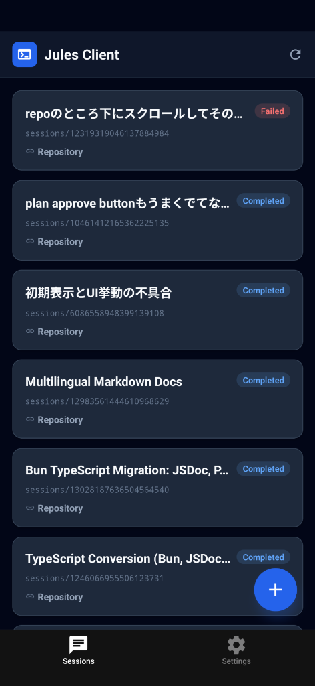
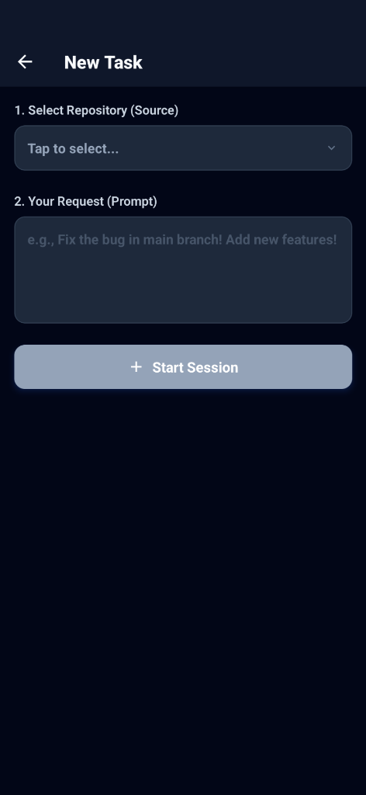
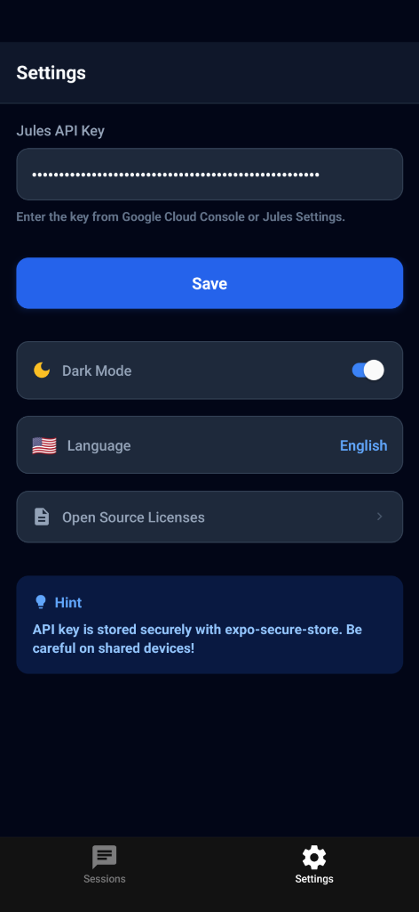

# Jules Mobile Client

<p align="center">
  
</p>

<p align="center">
  <strong>Google Jules AI コーディングアシスタントのReact Nativeモバイルクライアント</strong>
</p>

<p align="center">
  <a href="README.md">🇺🇸 English</a> •
  <a href="docs/ARCHITECTURE.md">📐 アーキテクチャ</a> •
  <a href="docs/API.md">🔌 API リファレンス</a> •
  <a href="docs/Agent.md">🤖 エージェントガイド</a>
</p>

---

## ✨ 特徴

-  **クロスプラットフォーム** - ExpoによりiOSとAndroidで動作
-  **ダークモード** - ライト/ダークテーマ完全対応
-  **多言語対応** - 日本語・英語のローカライズ
-  **セキュアストレージ** - expo-secure-storeによる安全なAPIキー保存
-  **リアルタイムチャット** - Julesセッションの表示と対話
-  **Markdown対応** - シンタックスハイライト付きリッチテキスト表示
- ⚡ **最適化されたパフォーマンス** - メモ化コンポーネントと効率的なリスト描画

##  スクリーンショット

<p align="center">
  
  
  
</p>

| セッション一覧 | タスク作成 | 設定 |
|:------------:|:--------:|:----:|
| 全アクティブセッションを表示 | 新規コーディングタスク作成 | APIキーと設定 |

##  はじめに

### 必要なもの

- [Bun](https://bun.sh/)（推奨のJavaScriptランタイム）
- [Node.js](https://nodejs.org/) 18以上（代替）
- [Expo CLI](https://docs.expo.dev/get-started/installation/)
- [Jules APIキー](https://console.cloud.google.com/) - Google Cloud Consoleから取得

### インストール

```bash
# リポジトリをクローン
git clone https://github.com/linkalls/jules-mobile-client.git
cd jules-mobile-client

# 依存関係をインストール (bun推奨)
bun install

# Expo固有パッケージのインストール
bunx expo install <package-name>

# 開発サーバーを起動
bun start
```

### デバイスで実行

```bash
# iOS シミュレーター
bun ios

# Android エミュレーター
bun android

# Web ブラウザ
bun web
```

### Bunコマンド早見表

```bash
# 開発
bun start          # Expo開発サーバー起動
bun ios            # iOSシミュレーターで実行
bun android        # Androidエミュレーターで実行
bun web            # ブラウザで実行

# パッケージ管理
bun install        # 全依存関係をインストール
bun add <pkg>      # 新しいパッケージを追加
bunx expo install <pkg>  # Expo互換バージョンを追加

# その他
bun lint           # ESLintを実行
bun reset-project  # クリーン状態にリセット
```

## ⚙️ 設定

### APIキーの設定

1. アプリを開く
2. **Settings**タブに移動
3. Jules APIキーを入力
4. キーはデバイスにセキュアに保存されます

>  APIキーは[Google Cloud Console](https://console.cloud.google.com/)またはJulesの設定ページから取得できます。

##  プロジェクト構成

```
jules-mobile-client/
├── app/                    # Expo Routerスクリーン
│   ├── (tabs)/            # タブナビゲーション
│   │   ├── index.tsx      # セッション一覧
│   │   └── settings.tsx   # 設定画面
│   ├── session/[id].tsx   # セッション詳細/チャット
│   ├── create-session.tsx # 新規タスク作成
│   └── _layout.tsx        # ルートレイアウト
├── components/
│   ├── jules/             # Jules専用コンポーネント
│   │   ├── activity-item.tsx  # チャット吹き出し + スケルトン
│   │   ├── session-card.tsx   # セッションカード + スケルトン
│   │   ├── loading-overlay.tsx
│   │   └── code-block.tsx     # シンタックスハイライト
│   └── ui/                # 汎用UIコンポーネント
├── constants/
│   ├── types.ts           # TypeScript型定義
│   ├── i18n.ts            # 翻訳
│   └── theme.ts           # カラースキーム
├── hooks/
│   ├── use-jules-api.ts   # Jules APIフック
│   └── use-secure-storage.ts
└── docs/                  # ドキュメント
```

##  Jules API 連携

アプリは[Jules API](https://jules.googleapis.com/v1alpha)と連携して以下を実現：

- **セッション一覧** - 全コーディングセッションの表示
- **セッション作成** - リポジトリコンテキスト付きで新規タスク開始
- **アクティビティ表示** - ポーリングによるリアルタイムチャット履歴
- **プラン承認** - AI生成プランの確認

詳細は[APIリファレンス](docs/API.md)を参照。

## ️ 技術スタック

| 技術 | 用途 |
|-----|-----|
| [Expo SDK 54](https://expo.dev/) | React Nativeフレームワーク |
| [Expo Router](https://docs.expo.dev/router/introduction/) | ファイルベースルーティング |
| [React Native 0.81](https://reactnative.dev/) | モバイルUIフレームワーク |
| [TypeScript](https://www.typescriptlang.org/) | 型安全性 |
| [expo-secure-store](https://docs.expo.dev/versions/latest/sdk/securestore/) | セキュアストレージ |
| [react-native-markdown-display](https://github.com/iamacup/react-native-markdown-display) | Markdownレンダリング |

##  本番ビルド

### EAS Buildを使用

```bash
# EAS CLIをインストール
npm install -g eas-cli

# Expoにログイン
eas login

# Android用ビルド（APK）
eas build --platform android --profile production

# iOS用ビルド
eas build --platform ios --profile production
```

### ビルドプロファイル

| プロファイル | 説明 |
|------------|------|
| `development` | デバッグ付き開発クライアント |
| `preview` | 内部配布用APK |
| `production` | 本番用ビルド |

##  コントリビューション

コントリビューションは大歓迎です！PRを送る前にコントリビューションガイドラインをお読みください。

1. リポジトリをフォーク
2. フィーチャーブランチを作成 (`git checkout -b feature/amazing-feature`)
3. 変更をコミット (`git commit -m 'Add amazing feature'`)
4. ブランチにプッシュ (`git push origin feature/amazing-feature`)
5. Pull Requestを作成

## �� ライセンス

このプロジェクトはBSD 2-Clauseライセンスの下で公開されています - 詳細は[LICENSE](LICENSE)ファイルを参照してください。

##  謝辞

- [Google Jules](https://jules.google/) - AIコーディングアシスタント
- [Expo](https://expo.dev/) - 素晴らしいReact Nativeツール
- [React Native](https://reactnative.dev/) - モバイルフレームワーク

---

<p align="center">
  Made with ❤️ by <a href="https://github.com/linkalls">linkalls</a>
</p>
