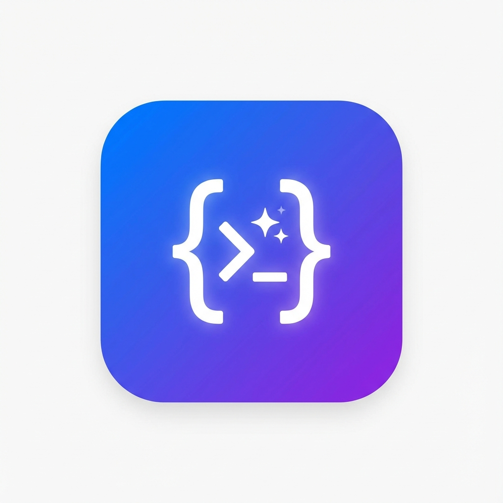
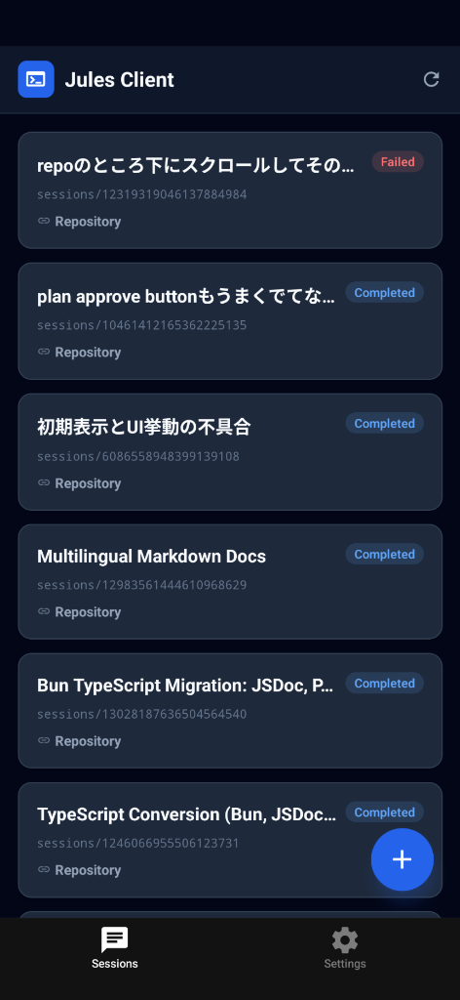
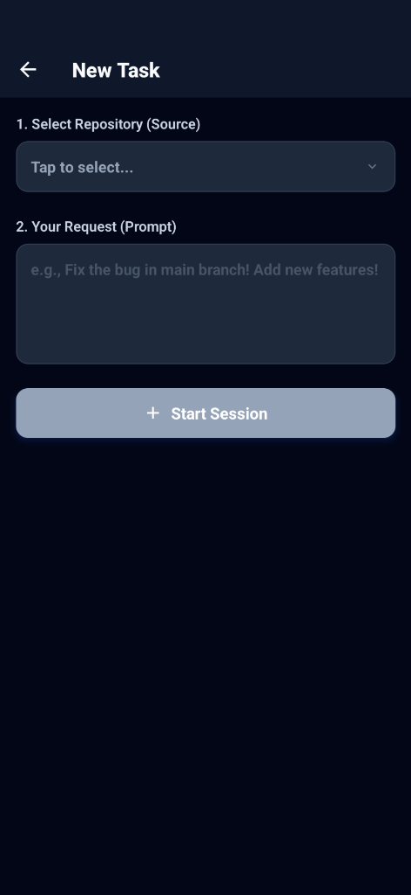
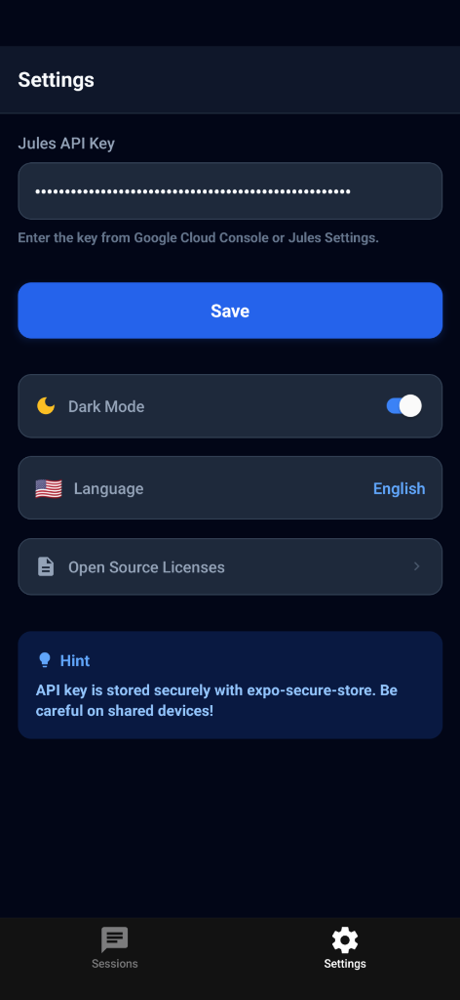

# Jules Mobile Client

<p align="center">
  
</p>

<p align="center">
  <strong>A React Native mobile client for Google's Jules AI coding assistant</strong>
</p>

<p align="center">
  <a href="https://github.com/linkalls/jules-mobile-client/blob/main/LICENSE">
    
  </a>
  <a href="https://github.com/linkalls/jules-mobile-client/releases">
    
  </a>
  <a href="https://expo.dev/">
    
  </a>
  <a href="https://reactnative.dev/">
    
  </a>
  <a href="https://www.typescriptlang.org/">
    
  </a>
</p>

<p align="center">
  <a href="README.ja.md">🇯🇵 日本語</a> •
  <a href="docs/ARCHITECTURE.md">📐 Architecture</a> •
  <a href="docs/API.md">🔌 API</a> •
  <a href="docs/MODE_SELECTION.md">🎯 Modes</a> •
  <a href="docs/SECURITY.md">🔐 Security</a> •
  <a href="docs/PRODUCTION.md">🚀 Production</a> •
  <a href="docs/FAQ.md">❓ FAQ</a>
</p>

---

## ✨ Features

### Core Functionality
- 📱 **Cross-Platform** - Works on iOS and Android via Expo
- 🌙 **Dark Mode** - Full dark/light theme support with auto-detection
- 🌐 **i18n** - Japanese and English localization
- 🔐 **Secure Storage** - API keys stored securely with expo-secure-store
- 💬 **Real-time Chat** - View and interact with Jules sessions
- 📝 **Markdown Support** - Rich text rendering with syntax highlighting
- ⚡ **Optimized Performance** - Memoized components and efficient list rendering
- 📸 **Photo Upload Ready** - UI prepared for photo attachments (API support pending)

### Enhanced User Experience
- 🔍 **Search Sessions** - Quickly find sessions by title or name
- 🔄 **Sort & Filter** - Sort by date or title, filter by status (Active/Completed/Failed)
- 📊 **Smart Session Management** - Recent repos tracking and intelligent UI
- ✨ **Modern UI** - Gradient-based design with haptic feedback
- ♿ **Accessibility** - Screen reader support and semantic labels
- ℹ️ **Version Info** - App version display in settings
- 🎯 **Mode Selection** - Choose between Start (auto-execute) or Review (manual approval) modes
- 📋 **Plan Approval Flow** - Review and approve AI-generated plans before execution
- 🔄 **Session State Tracking** - Real-time state badges showing current session status
- 📤 **Export & Share** - Export sessions to Markdown or JSON formats for sharing and archiving

## 📸 Screenshots

### Light Theme
<p align="center">
  
  
  
</p>

| Sessions | New Task | Settings |
|:--------:|:--------:|:--------:|
| View all active sessions | Create new coding tasks | Configure API key & preferences |

### Dark Theme
The app features a beautiful dark theme that can be toggled in Settings or automatically follows your system preferences.

> **Note**: Dark theme screenshots will be added soon. The app fully supports dark mode with a modern gradient-based design optimized for OLED displays.

**New Features in Latest Update:**
- 🎯 **Mode Selection** - Choose Start (auto-execute) or Review (manual approval) mode when creating sessions
- 📋 **Plan Approval Flow** - Review AI-generated plans before execution in Review mode
- 🔄 **Session State Tracking** - Real-time color-coded state badges (Queued, Planning, In Progress, etc.)
- 🔍 **Search & Filter** - Quickly find sessions with search and filter by status
- 📊 **Sort Options** - Sort sessions by date (newest/oldest) or title
- 📤 **Export & Share** - Export sessions to Markdown or JSON and share with others
- ℹ️ **App Version Display** - View current version in Settings
- ♿ **Accessibility Improvements** - Better screen reader support
- 🔒 **Security Enhancement** - Removed debug logging in production
- 📚 **Commercial Readiness** - Comprehensive documentation for production use

## 🚀 Getting Started

### Prerequisites

- [Bun](https://bun.sh/) (recommended JavaScript runtime)
- [Node.js](https://nodejs.org/) 18+ (alternative)
- [Expo CLI](https://docs.expo.dev/get-started/installation/)
- [Jules API Key](https://console.cloud.google.com/) from Google Cloud Console

### Installation

```bash
# Clone the repository
git clone https://github.com/linkalls/jules-mobile-client.git
cd jules-mobile-client

# Install dependencies (using bun - recommended)
bun install

# Or install Expo-specific packages
bunx expo install <package-name>

# Start the development server
bun start
```

### Running on Device

```bash
# iOS Simulator
bun ios

# Android Emulator
bun android

# Web Browser
bun web
```

### Bun Commands Quick Reference

```bash
# Development
bun start          # Start Expo dev server
bun ios            # Run on iOS simulator
bun android        # Run on Android emulator
bun web            # Run in browser

# Package management
bun install        # Install all dependencies
bun add <pkg>      # Add a new package
bunx expo install <pkg>  # Add Expo-compatible package version

# Other
bun lint           # Run ESLint
bun reset-project  # Reset to clean state
```

## ⚙️ Configuration

### API Key Setup

You can configure your Jules API key in two ways:

**Method 1: Environment Variable (Recommended for development)**
Create a `.env` file in the root directory and add your key:
```bash
JULES_API_KEY=your_api_key_here
```

**Method 2: In-App Settings**
1. Open the app
2. Navigate to the **Settings** tab
3. Enter your Jules API Key
4. The key is securely stored on your device

> 💡 Get your API key from [Google Cloud Console](https://console.cloud.google.com/) or Jules Settings page.

## 📂 Project Structure

```
jules-mobile-client/
├── app/                    # Expo Router screens
│   ├── (tabs)/            # Tab navigation screens
│   │   ├── index.tsx      # Sessions list
│   │   └── settings.tsx   # Settings screen
│   ├── session/[id].tsx   # Session detail/chat
│   ├── create-session.tsx # New task creation
│   └── _layout.tsx        # Root layout
├── components/
│   ├── jules/             # Jules-specific components
│   │   ├── activity-item.tsx  # Chat bubbles + ActivityItemSkeleton
│   │   ├── session-card.tsx   # Session cards + SessionCardSkeleton
│   │   ├── loading-overlay.tsx
│   │   └── code-block.tsx     # Syntax highlighted code
│   └── ui/                # Generic UI components
├── constants/
│   ├── types.ts           # TypeScript types
│   ├── i18n.ts            # Translations
│   └── theme.ts           # Color schemes
├── hooks/
│   ├── use-jules-api.ts   # Jules API hook
│   └── use-secure-storage.ts
└── docs/                  # Documentation
```

## 🔌 Jules API Integration

The app integrates with the [Jules API](https://jules.googleapis.com/v1alpha) to:

- **List Sessions** - View all coding sessions
- **Create Sessions** - Start new tasks with repository context
- **View Activities** - Real-time chat history with polling
- **Approve Plans** - Confirm AI-generated plans

See [API Reference](docs/API.md) for detailed documentation.

## 🛠️ Tech Stack

| Technology | Purpose |
|------------|---------|
| [Expo SDK 54](https://expo.dev/) | React Native framework |
| [Expo Router](https://docs.expo.dev/router/introduction/) | File-based routing |
| [React Native 0.81](https://reactnative.dev/) | Mobile UI framework |
| [TypeScript](https://www.typescriptlang.org/) | Type safety |
| [expo-secure-store](https://docs.expo.dev/versions/latest/sdk/securestore/) | Secure storage |
| [react-native-markdown-display](https://github.com/iamacup/react-native-markdown-display) | Markdown rendering |

## 📱 Building for Production

### Using EAS Build

```bash
# Install EAS CLI
npm install -g eas-cli

# Login to Expo
eas login

# Build for Android (APK)
eas build --platform android --profile production

# Build for iOS
eas build --platform ios --profile production
```

### Build Profiles

| Profile | Description |
|---------|-------------|
| `development` | Development client with debugging |
| `preview` | Internal distribution APK |
| `production` | Production-ready build |

## 🐛 Troubleshooting

Having issues? Check our comprehensive troubleshooting guide:

- **[Troubleshooting Guide](docs/TROUBLESHOOTING.md)** - Common issues and solutions
- **[FAQ](docs/FAQ.md)** - Frequently asked questions

### Quick Fixes

```bash
# Clear cache and restart
bun start --clear

# Reinstall dependencies
rm -rf node_modules && bun install

# Reset project
bun run reset-project
```

## 📚 Documentation

| Document | Description |
|----------|-------------|
| [FAQ](docs/FAQ.md) | Frequently asked questions |
| [Troubleshooting](docs/TROUBLESHOOTING.md) | Common issues and solutions |
| [Architecture](docs/ARCHITECTURE.md) | App architecture overview |
| [API Reference](docs/API.md) | Jules API integration details |
| [Components](docs/COMPONENTS.md) | Component documentation |
| [Development](docs/DEVELOPMENT.md) | Development setup guide |
| [Mode Selection](docs/MODE_SELECTION.md) | Start vs Review modes |
| [Security](docs/SECURITY.md) | Security best practices |
| [Production Deployment](docs/PRODUCTION.md) | Production deployment guide |
| [Agent Guide](docs/Agent.md) | Guide for AI agents |
| [Contributing](CONTRIBUTING.md) | How to contribute |

## 🤝 Contributing

We welcome contributions! Whether it's bug reports, feature requests, documentation improvements, or code contributions, we appreciate your help.

Please read our [Contributing Guide](CONTRIBUTING.md) before submitting a PR.

### Quick Start

1. Fork the repository
2. Create your feature branch (`git checkout -b feature/amazing-feature`)
3. Commit your changes (`git commit -m 'feat: add amazing feature'`)
4. Push to the branch (`git push origin feature/amazing-feature`)
5. Open a Pull Request

### Ways to Contribute

- 🐛 **Report bugs** via GitHub Issues
- 💡 **Suggest features** through feature requests
- 📝 **Improve documentation** 
- 🌍 **Add translations** for new languages
- 💻 **Submit code** improvements

## 🗺️ Roadmap

Potential future features (community-driven):

- [x] Session export/sharing functionality ✅ (v1.1.0)
- [x] Statistics and analytics dashboard ✅
- [ ] Push notifications for session updates
- [ ] Offline mode support
- [ ] Multi-account management
- [ ] Custom theme support
- [ ] Additional language translations
- [ ] Voice input for task descriptions
- [ ] Session templates
- [ ] Advanced filtering and search

Want to help? Check out [open issues](https://github.com/linkalls/jules-mobile-client/issues) or suggest new features!

## 🏢 Commercial Use & Legal

### License

This project is licensed under the **BSD 2-Clause License** - see the [LICENSE](LICENSE) file for details.

**What this means:**
- ✅ **Commercial use allowed** - You can use this in commercial projects
- ✅ **Modification allowed** - You can modify the code
- ✅ **Distribution allowed** - You can distribute the app
- ⚠️ **No warranty** - Software is provided "as is"
- ⚠️ **Attribution required** - Keep the copyright notice

### Important Disclaimers

**This is an unofficial third-party client.** This app is not affiliated with, endorsed by, or sponsored by Google or the Jules team.

**Use at your own risk:**
- This app is provided for educational and development purposes
- Users are responsible for compliance with Google's Terms of Service
- API usage is subject to Google's quotas and pricing
- No warranty or guarantees are provided

### Data & Privacy

**API Key Security:**
- API keys are stored locally using `expo-secure-store`
- Keys are never transmitted to third parties
- Keys are only sent to Google's Jules API endpoints

**Data Collection:**
- This app does NOT collect any user data
- All data stays on your device and Google's servers
- No analytics, tracking, or telemetry by default

**For Commercial Deployments:**
- Review and comply with Google's Terms of Service
- Implement your own privacy policy if required
- Consider adding user consent mechanisms
- Implement proper API key management for teams
- Set up monitoring and rate limiting

See [docs/SECURITY.md](docs/SECURITY.md) for security best practices.

## 🙏 Acknowledgments

- [Google Jules](https://jules.google/) - AI coding assistant
- [Expo](https://expo.dev/) - Amazing React Native tooling
- [React Native](https://reactnative.dev/) - Mobile framework
- All our [contributors](https://github.com/linkalls/jules-mobile-client/graphs/contributors)

## ⭐ Support

If you find this project useful, please consider:

- ⭐ **Starring** the repository
- 🐛 **Reporting bugs** to help improve the app
- 💡 **Suggesting features** you'd like to see
- 🤝 **Contributing** code or documentation
- 📢 **Sharing** with others who might benefit

---

<p align="center">
  Made with ❤️ by <a href="https://github.com/linkalls">linkalls</a>
</p>
